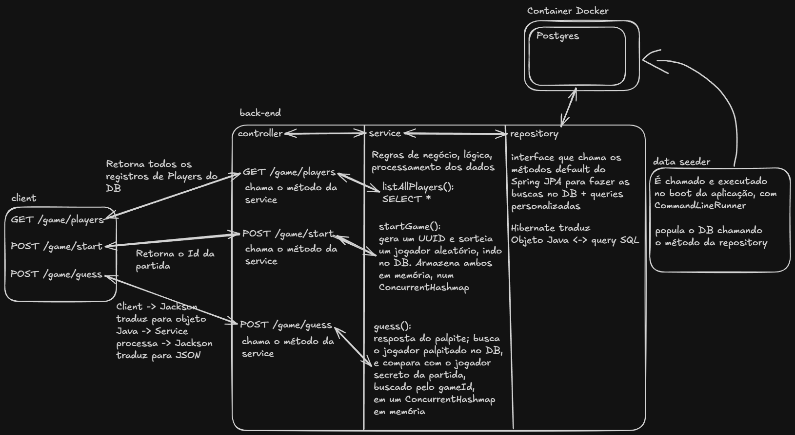

# WhosThePlayer
 
A Wordle-style football guessing game: each round, you try to identify a **secret player** through guesses.
 
This is a personal project built as a hands-on learning exercise and as a portfolio piece. The goal is a platform hosting several games, evolving incrementally. It currently ships with **one game**: guess the secret player.
 
## Tech Stack
 
- **Backend:** Java + Spring (Spring Data JPA)
- **Database:** PostgreSQL (running in Docker)
- **Frontend:** not implemented yet
## How It Works
 
When a match starts, the backend picks a random secret player and keeps the match state **in memory**, indexed by a randomly generated match ID. The client receives that ID and uses it on every subsequent guess.
 
Incoming guesses are compared against the secret player of the corresponding match. The full player list is exposed separately so the client can build its guessing UI.
 
## Architecture
 
The backend follows the standard Spring layered architecture: **controller → service → repository**.
 
- **Controller** — receives HTTP requests, delegates to the service.
- **Service** — business logic: starting matches, evaluating guesses, listing players.
- **Repository** — a Spring Data JPA interface that talks to the database (Hibernate handles the Object ↔ SQL mapping), with custom queries where needed.
- **Data Seeder** — runs on application boot via `CommandLineRunner` and populates the database with the player data.

 
> _Serialization note:_ JSON ↔ Java object conversion is handled by Jackson (Spring's default) at the controller layer. Hibernate handles Java object ↔ database mapping at the repository layer. The two are separate concerns.
 
## API
 
The API currently exposes three endpoints.
 
### `GET /game/players`
 
Returns the full list of players, used by the client to build the guessing interface.
 
**Response:**
```json
[
  { "playerId": "<id>", "playerName": "<name>" }
]
```
 
### `POST /game/start`
 
Starts a new match. The backend generates a UUID, picks a random secret player, stores the match state in memory, and returns the match ID.
 
**Response:**
```json
{
  "matchId": "<random-match-id>"
}
```
 
### `POST /game/guess`
 
Submits a guess for an ongoing match.
 
**Request:**
```json
{
  "matchId": "<match-id>",
  "playerId": "<guessed-player-id>"
}
```
 
## Technical Decisions
 
A few choices worth explaining, since the *why* matters more than the *what*:
 
- **Match state lives in memory, not in the database.** A match is short-lived and read frequently during play, so an in-memory store avoids unnecessary database round-trips. The database holds the persistent data (the player catalog); the ephemeral per-match state does not need to be persisted. _Trade-off:_ state is lost on restart and does not scale across multiple instances.
- **`ConcurrentHashMap` for the in-memory match store.** Each HTTP request is handled on its own thread (Tomcat's thread pool), so multiple clients can hit `/game/start` and `/game/guess` concurrently, all touching the same map. `ConcurrentHashMap` provides thread-safe access without locking the entire map: reads are lock-free and writes lock only the affected bucket, so operations on different keys run in parallel. This avoids both the structural corruption a plain `HashMap` can suffer under concurrency and the throughput bottleneck of a globally synchronized map.
- **PostgreSQL in Docker.** Running the database in a container keeps the local setup reproducible and isolated from the host, so the project can be spun up consistently on any machine without a manual Postgres install.
## Running Locally
 
> _Setup instructions will be expanded as the project matures._
 
**Prerequisites:** Java, Docker.
 
```bash
# Start the database (PostgreSQL via Docker)
docker compose up -d
 
# Run the backend
./mvnw spring-boot:run
```
 
The data seeder populates the database on first boot.
 
## Roadmap
 
- Build the frontend
- Richer guess feedback (per-attribute hints, Wordle-style)
- Add new games to the platform